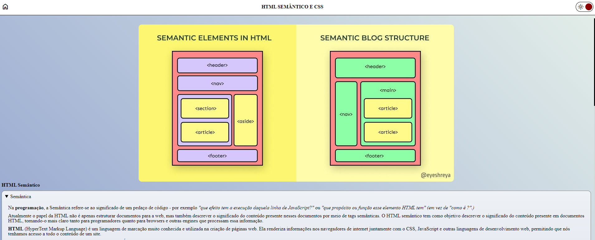
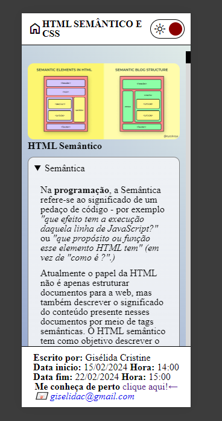

  
  

 
  
     
    
     
      

 <a href="#eye_speech_bubble-visualizar">Visualizar</a> •
 <a href="#information_source-sobre">Sobre</a> •
 <a href="#hammer_and_wrench-tecnologias">Tecnologias</a> • 
 <a href="#brain-conceitos-aplicados">Conceitos</a> •
 <a href="#girl-autor">Autor</a> •
 <a href="#balance_scale-licença">Licença</a>

---

## :eye_speech_bubble: **Visualizar**

|                            :computer: Desktop                             |                              :iphone: Mobile                               |
| :----------------------------------------------------------------------: | :------------------------------------------------------------------------: |
| <kbd></kbd> | <kbd></kbd> |

  
---

## :information_source: _Sobre_

Este artigo tem como objetivo proporcionar uma compreensão básica de algumas tags do HTML e a manipulação do CSS, apresentando exemplos para ilustrar suas aplicações práticas e destacar as melhores práticas para utilizá-los de forma eficaz.

Ao final deste artigo, você terá uma base sólida em HTML e CSS, permitindo escrever código mais semântico, sustentável e eficiente em seus projetos de desenvolvimento web.

Obs: "Todas as iterações deste projeto são constituídas apenas por HTML e CSS."

## :hammer_and_wrench: _Tecnologias_

|         :globe_with_meridians: FrontEnd          |
| :----------------------------------------------: |
|    [HTML 5](https://www.w3schools.com/html/)     |
| [CSS](https://www.w3schools.com/css/default.asp) |

---

## :brain: _Conceitos Aplicados_

| :page_facing_up: |
| :--------------: |
|   Primeiro Mobile    |
|    Classe HTML    |
|    Classe CSS     |
|    Propriedades CSS     |
|    Funções CSS     |
|    Valor da Propriedade    |
|    Seletor de Atributo    |
|    Seletores CSS    |
| Pseudo-elementos  |
| Pseudo-classes  |
| Propriedades de Tamanho  |
|     Flex-box     |
|     Flex-grid     |

---

## :girl: _Autor_

<a href="https://github.com/giselida">
 
  
 <b>Gisélida Cristine de Melo</b>
</a>

Desenvolvido com ❤️ por Gisélida Cristine de Melo 👋🏽 Meus Contatos!

---

## :balance_scale: _Licença_

Direitos Autorais ©️ 2024 [Gisélida Cristine de Melo](https://github.com/giselida). 
Este projeto é licenciado pela [MIT](./LICENSE).

